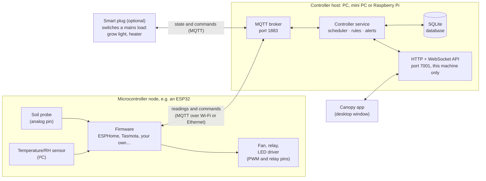

<h1 align="center">Canopy</h1>

<p align="center">
  <strong>A local-first controller for indoor grows.</strong><br>
  Works with the microcontrollers and smart switches on your network: charts
  what your sensors measure, and runs your lights, fans and pumps on
  schedules and rules. No cloud account, no vendor app, no Home Assistant.
</p>

<p align="center">
  <a href="https://github.com/LASR-0/Canopy/actions/workflows/ci.yml"></a>
  <a href="https://github.com/LASR-0/Canopy/actions/workflows/package.yml"></a>
  <!-- TODO: license badge, once a LICENSE file is added -->
  <!-- TODO: latest release badge, once there is a release -->
</p>

> [!WARNING]
> **Canopy is pre-release.** Every feature below works against the built-in
> device simulator, but it has not yet been tested with real hardware. That
> testing is the next phase (see [ROADMAP.md](ROADMAP.md), Phase 10). There
> are no published releases yet, so for now Canopy is built from source.

- [About](#about)
- [Screenshots](#screenshots)
- [Features](#features)
- [How it works](#how-it-works)
- [Requirements](#requirements)
- [Recommended setup](#recommended-setup)
- [Install](#install)
- [First-time setup](#first-time-setup)
- [Supported devices](#supported-devices)
- [Limitations](#limitations)
- [Dependencies](#dependencies)
- [Troubleshooting](#troubleshooting)
- [Building from source](#building-from-source)
- [Contributing](#contributing)
- [License](#license)

## About

Canopy is an open-source desktop app for running a grow tent or room with
hardware you choose yourself. Most grow hardware cannot join a network on its
own: soil probes are analog, and fans and LED drivers are switched from pins.
So your sensors and equipment wire to a **microcontroller** such as an ESP32,
running firmware of your choice, and **smart plugs** can switch mains loads
like a grow light or heater. Canopy finds those boards on your local network,
records what their sensors measure, and switches equipment on a photoperiod,
on a timer, or when a reading crosses a threshold.

Everything stays on your network. Canopy talks to devices directly over MQTT
and HTTP, keeps its data in a local SQLite database, and needs no internet
connection once installed.

It has two parts:

- **The controller**, a background service that starts with the machine and
  keeps running whether or not the app is open. It runs the MQTT broker your
  devices connect to, stores readings, and runs every schedule and rule.
- **The app**, the window you use to watch and configure it. Closing it never
  stops the controller, so a missed light cycle never depends on a window
  being open.

## Screenshots

<!--
TODO: screenshots of the real app, light and dark. Suggested set:
  1. Overview: sensor cards, sparklines, activity feed
  2. Setup View: the floor plan (Layout) and the 3D view
  3. Automation: a photoperiod window and a temperature rule
  4. Logging: a 24H chart
  5. Settings: discovered devices and roles
Store them in docs/images/ and show two side by side here, as LocalSend does.
-->

> [!NOTE]
> **To do:** screenshots of the app.

## Features

| Page | What it does |
|---|---|
| **Overview** | Live readings per sensor with sparklines, VPD and DLI derived from them, device status, and an activity feed of everything the controller did |
| **Setup View** | A to-scale floor plan of the tent: devices at their mounting heights, and plants. A 3D view renders the same plan |
| **Automation** | Photoperiod windows, timed events and threshold rules, each driving a *role* such as "exhaust fan", so hardware can be swapped without touching them. Can be limited to grow stages |
| **Target ranges** | The range each metric should stay in, per grow stage. Alerts fire when a reading leaves it and again when it recovers |
| **Grow Cycle** | Stages from seedling to harvest, with dates, and a harvest record |
| **Journal** | Notes and photos for the current grow, and an archive of finished grows to compare |
| **Maintenance** | Recurring tasks (cleaning sensors, swapping filters, calibrating) with due dates |
| **Logging** | Charts of every metric over time, and exports |
| **Settings** | Scanning for devices, roles, device broker logins, workspaces, backups and import/export |

Readings are kept at full detail for about a week, then as hourly and daily
averages. Each finished grow is archived to its own file.

## How it works



- **A device is a board, not a sensor.** Sensors and equipment wire to a
  microcontroller node, which reads them, drives its outputs, and talks to
  the controller over the network. A smart plug or relay is a board too.
  Canopy shows each board as one device, with all its sensors and outputs.
  Nothing is wired to the controller's machine.
- **Boards connect to the controller**, not the other way round. Each one
  publishes its readings to Canopy's built-in MQTT broker and listens there
  for commands. Canopy learns what a board has when it announces itself in
  the [Home Assistant MQTT discovery](https://www.home-assistant.io/integrations/mqtt/#mqtt-discovery)
  format (Canopy follows the format only, and needs no Home Assistant). See
  [Supported devices](#supported-devices).
- **The controller makes every decision.** Boards only measure, switch,
  and keep their own failsafes (such as a maximum on-time) for when the
  controller cannot be reached.
  Schedules run in the tent's own timezone, and a controller that restarts
  part-way through the light period switches the lights back on.
- **The app is a client.** It talks to the controller over HTTP and a
  WebSocket on `127.0.0.1:7001`, and shows the controller as offline if it
  is not running.
- **Each device gets its own broker login** when it is paired, limited to its
  own topics. No device can command another.

### Connections and ports

| Traffic | Protocol | Port | Direction | Listens on |
|---|---|---|---|---|
| Devices ↔ controller | MQTT (TCP) | 1883 | Devices connect in | Every interface by default; can be pinned to one address in Settings |
| App ↔ controller | HTTP + WebSocket | 7001 | Local only | `127.0.0.1` |
| Device discovery | mDNS (UDP) | 5353 | Both | Every interface |

The Windows installer opens 1883/TCP and 5353/UDP in Windows Firewall, for
private and domain networks only. On Linux, allow them in your firewall if
it blocks inbound traffic (see [Troubleshooting](#troubleshooting)).

> [!IMPORTANT]
> MQTT traffic is not encrypted in this version. Logins and readings cross
> your LAN in plain text. Run Canopy on a network you trust; TLS is planned
> after real-device testing.

## Requirements

### Software

| | Supported | Notes |
|---|---|---|
| **Linux** | x64, with systemd and glibc | Packages for Debian/Ubuntu (.deb), Fedora/RHEL (.rpm) and Arch (pacman). Other distros: the controller-only tarball |
| **Linux, headless** | x64 or arm64, with systemd and glibc | The controller-only tarball; arm64 covers a Raspberry Pi 4 or 5 on 64-bit Raspberry Pi OS. The arm64 build has not been run on a Pi yet |
| **Windows** | Windows 10 or 11, x64 | Installing needs administrator rights, because the controller is a Windows service. Uses .NET Framework 4.6.1 or later, which every supported Windows already has |
| **macOS** | Not yet | Planned once there is a Mac to test on |

Not supported: Linux without systemd (OpenRC, runit), musl distros such as
Alpine, and 32-bit systems.

### Hardware

- **A controller host that stays on.** Any machine that can run the
  controller as a service: your desktop, a mini PC, or a Raspberry Pi 4 or 5.
  It must be on whenever the grow is running, since it switches the
  equipment.
- **Disk space**: about 130 MB for the controller, plus the database, which
  grows with the number of sensors and how often they report.
- **A network** your devices and the controller share. Devices need to reach
  the controller's address on port 1883.
- **Boards**: microcontroller nodes and smart switches whose firmware
  publishes over MQTT in the Home Assistant discovery format. See
  [Hardware setups](#hardware-setups) and
  [Supported devices](#supported-devices).

> [!NOTE]
> **To do:** measured CPU, memory and disk figures for a typical tent, once
> real-device testing has run one.

## Recommended setup

**One tent, one machine.** Install the desktop package on the computer near
the tent. The controller and the app run on the same machine, which is the
simplest setup and the one tested most.

**An always-on box by the tent.** If your desktop is not on all the time, run
the controller on a Raspberry Pi 4 or 5 (or a mini PC) with the
controller-only tarball, and keep the app on your desktop.

> [!NOTE]
> **To do:** connecting the app to a controller on another machine. The app
> currently reaches the controller only on its own machine. Until that is
> built, an SSH tunnel works: `ssh -L 7001:127.0.0.1:7001 <pi-address>`, then
> open the app on your desktop.

### Hardware setups

Three ways to put the hardware together. Canopy treats them all the same:
automations drive roles such as "grow light", so you can change the
hardware behind a role later without touching them.

| | Microcontroller nodes | Smart switches only | Hybrid |
|---|---|---|---|
| **What it is** | Sensors and equipment wired to one or more nodes (an ESP32, say) | Smart plugs and network sensors, no wiring | Smart plugs for mains loads, a node for sensors and low-voltage gear |
| **Sensors** | Anything with pins: analog probes, I²C, 1-Wire, serial | Mostly temperature and humidity; few others come ready to connect | Anything, on the node |
| **Equipment** | PWM fans with speed control, dimmable LED strips, relays; mains through a relay module or contactor | On/off for anything that plugs in | Mains on plugs; speed and dimming on the node |
| **Wiring** | Some: low-voltage, headers and jumper wires; mains needs care | None | Low-voltage only |
| **Failsafes** | In the node's firmware | Plug auto-off timers | Both |

**Hybrid is the recommended start**: one node with a temperature and
humidity sensor, a soil probe and a fan, and a smart plug for the light.
That covers reading, scheduling and a rule, and keeps your hands off mains
wiring.

> [!NOTE]
> **To do:** an example node, a ready-made ESPHome configuration for that
> setup, so building it is wiring and flashing.

## Install

> [!NOTE]
> **To do:** download links. There are no published releases yet. Until the
> first one, packages are built by CI (the *Packages* workflow) or from
> source; see [Building from source](#building-from-source).

| Linux | Windows | macOS |
|---|---|---|
| `.deb` (Debian, Ubuntu) | Installer (`.exe`) | Not yet |
| `.rpm` (Fedora, RHEL) | | |
| pacman (Arch) | | |
| Controller-only `.tar.gz` (x64, arm64) | | |

Every desktop package installs **both** the app and the controller, and
starts the controller as a service. You do not install them separately.

### Linux

Install the package for your distro:

```bash
# Debian, Ubuntu
sudo apt install ./canopy_<version>_amd64.deb

# Fedora, RHEL
sudo dnf install ./canopy-<version>.x86_64.rpm

# Arch
sudo pacman -U ./canopy-<version>.pacman
```

The install enables and starts the controller (`canopy.service`), and adds
Canopy to your app menu. Check on the controller with:

```bash
systemctl status canopy
journalctl -u canopy -f
```

Installing a newer package over an old one upgrades it and restarts a running
controller. A controller you stopped or disabled stays that way.

<details>
<summary><b>Headless (controller only)</b></summary>

For a machine with no desktop, such as a Raspberry Pi by the tent, or a
distro without a Canopy package:

```bash
tar xzf canopy-controller-<version>-linux-<arch>.tar.gz
cd canopy-controller-<version>-linux-<arch>
sudo ./install.sh
```

The controller brings its own Node runtime, so nothing else needs
installing. Run `install.sh` again from a newer tarball to upgrade. It
refuses to install over the desktop package, which already includes the
controller.

</details>

**Uninstalling** stops and removes the controller. Your data in
`/var/lib/canopy` is kept; delete it by hand if you want it gone.

### Windows

Run the installer and accept the administrator prompt. It installs the app,
registers the controller as the **Canopy** service (starting automatically,
running as its own limited account), and adds the firewall rules.

Check on the controller in PowerShell:

```powershell
Get-Service Canopy
Start-Service Canopy
```

Data lives in `%ProgramData%\Canopy`, and the controller's logs in
`%ProgramData%\Canopy\logs`. Uninstalling removes the service and the
firewall rules and keeps the data.

> [!NOTE]
> **To do:** the installer is not code-signed yet, so Windows SmartScreen
> warns before running it.

### macOS

> [!NOTE]
> **To do:** not supported yet. A macOS build needs a Mac to test it on.

## First-time setup

On first start the controller creates a workspace called **My Workspace**,
in your computer's timezone. A workspace is one tent or grow space;
everything in Canopy belongs to one.

1. **Open Canopy.** If it says the controller isn't answering, see
   [Troubleshooting](#troubleshooting).
2. **Get your boards on the network.** Wire your sensors and equipment to
   your node and flash its firmware; connect nodes and smart plugs to your
   Wi-Fi with their own setup page or app.
3. **Point each device at the controller.** Set its MQTT server to the
   controller's address, port 1883. **Settings → Device connections** lists
   the address for each network interface, with the shared login for devices
   not yet paired. ESPHome needs the `mqtt:` component in its configuration
   (discovery is on by default); Tasmota needs Home Assistant discovery
   turned on (`SetOption19 1`).
4. **Scan.** In **Settings**, press **Scan network**. Canopy listens for 20 seconds
   while devices announce themselves. Power-cycle a device if it does not
   show up. Add the ones you want.
5. **Give each device its own login.** Each device card has a **Broker login**
   button. Shelly devices are sent theirs automatically; for anything else,
   copy it into the board's MQTT settings and flash or restart it.
6. **Assign roles.** In **Settings → Device roles**, say what each device is
   for: canopy temperature, grow light, exhaust fan, and so on. Automations
   drive roles, not devices.
7. **Set up the tent.** In **Setup View**, enter the tent's size and place
   the devices and plants.
8. **Add automations.** In **Automation**, add a photoperiod window for the
   light, and rules such as "exhaust on above 28 °C". Set the ranges you want
   to be alerted about in **Target ranges**.
9. **Start a grow** in **Grow Cycle**, so stage-specific automations and
   ranges apply.

Once every device has its own login, turn on **Require the password** in
**Settings → Device connections** so nothing else on your network can
connect.

> [!NOTE]
> **To do:** a setup walkthrough per firmware (ESPHome, Tasmota, Shelly,
> custom), written during real-device testing.

## Supported devices

> Canopy works with any microcontroller firmware that publishes over MQTT
> using the Home Assistant discovery format.

Compatibility comes from that format, not from a brand. MQTT alone is only
the transport: a message such as `23.4` on `node1/sensor/a` does not say
what it measures. The discovery format is how a board tells Canopy its
topics, what each value is and its unit, the words that switch each output,
and which channels belong to it. Many firmwares already speak it:

| Firmware | How it connects | Status |
|---|---|---|
| [ESPHome](https://esphome.io) | MQTT discovery (add the `mqtt:` component) | Not yet tested on hardware. **To do:** reading ESPHome's shortened discovery keys |
| [Tasmota](https://tasmota.github.io) | MQTT discovery in Home Assistant mode (`SetOption19 1`) | Not yet tested on hardware. **To do:** value templates, which Tasmota's sensor readings use. Tasmota's own discovery format is not supported |
| [OpenMQTTGateway](https://docs.openmqttgateway.com) | MQTT discovery | Not yet tested |
| Your own Arduino or MicroPython code | MQTT discovery, published by hand or with a library such as [ArduinoHA](https://github.com/dawidchyrzynski/arduino-home-assistant) | Not yet tested on hardware. Canopy's device simulator announces itself this way, and works |
| Shelly Gen 1 | Shelly's own MQTT announce, and mDNS | Not yet tested on hardware |
| Shelly Gen 2 and later (Plus, Pro, Gen 3, Gen 4) | — | **To do:** not supported yet |

Plugs sold pre-flashed with ESPHome or Tasmota count as that firmware.

> [!NOTE]
> **To do:** adding a device by hand, for firmware that publishes over MQTT
> but does not announce itself: you would enter its topics, what each value
> is, and its on/off words.

**Roles** say what a device is for. Sensing: canopy temperature, canopy
humidity, canopy light, root-zone moisture, CO₂, reservoir temperature, pH
and EC, power draw. Equipment: exhaust fan, intake fan, circulation fan,
light, pump, humidifier, dehumidifier, heater, CO₂ valve.

**Readings** Canopy understands: temperature, humidity, CO₂, soil moisture,
pH, EC, lux, PPFD, power and water level. VPD and DLI are worked out from
them.

## Limitations

- **Not tested on real hardware yet.** Expect bugs with real devices until
  the testing phase is done.
- **No encryption on MQTT** (see the note in
  [How it works](#how-it-works)).
- **The app must run on the controller's machine**, or reach it through an
  SSH tunnel.
- **Only firmware that announces itself** in the Home Assistant discovery
  format can be added; adding a device by hand is still to do.
- **Part of the discovery format is not read yet**: shortened keys, which
  ESPHome and Tasmota send, and value templates. Until they are, real
  firmware may pair with missing sensors or not at all.
- **Shelly Gen 2 and later are not supported**, which covers the Shelly
  devices sold today. Plugs pre-flashed with ESPHome or Tasmota are the
  alternative.
- **One tent per workspace.** Several tents means several workspaces, each
  viewed on its own.
- **No manual switches in the app**, by design: automations switch
  equipment, so nothing in the app fights the next scheduled change. An
  automation can be held off or overridden for a while.
- **Alerts are in-app only**: no email or push notifications.
- **Sensors that sleep**, such as battery sensors, are marked offline after
  5 minutes without a report.
- **Wi-Fi provisioning from the app** is not proven against real devices.
  Set up Wi-Fi with each device's own app.
- **Not supported**: macOS, vendor clouds (AC Infinity, Spider Farmer,
  VIVOSUN), Home Assistant integration, cameras.

See [ROADMAP.md](ROADMAP.md) for what is planned.

## Dependencies

**To run Canopy**, nothing beyond the package. The controller ships with its
own Node.js runtime and SQLite library, and the app is self-contained
(Electron). The Linux packages pull in the usual desktop libraries (GTK, NSS,
ALSA) through your package manager.

**Built with:**

| Part | Libraries |
|---|---|
| Controller | [Node.js](https://nodejs.org), [Fastify](https://fastify.dev), [Aedes](https://github.com/moscajs/aedes) (MQTT broker), [better-sqlite3](https://github.com/WiseLibs/better-sqlite3) and [Drizzle](https://orm.drizzle.team), [bonjour-service](https://github.com/onlxltd/bonjour-service) (mDNS) |
| App | [Electron](https://www.electronjs.org), [React](https://react.dev), [Tailwind CSS](https://tailwindcss.com), [TanStack Query and Table](https://tanstack.com), [Recharts](https://recharts.org), [three.js](https://threejs.org) via [react-three-fiber](https://r3f.docs.pmnd.rs) |
| Windows service | [WinSW](https://github.com/winsw/winsw) |

## Troubleshooting

| Problem | Platform | Fix |
|---|---|---|
| The app says the controller isn't answering | Linux | `systemctl status canopy`; start it with `sudo systemctl start canopy`; read `journalctl -u canopy` |
| | Windows | `Get-Service Canopy`; start it with `Start-Service Canopy`; read the logs in `%ProgramData%\Canopy\logs` |
| The controller exits saying it is already running | All | Another controller holds port 7001 or 1883. Only one may run at a time: stop the other one |
| Devices never appear in a scan | All | Check the device's MQTT server is the controller's address and port 1883, and that a firewall is not blocking 1883/TCP or 5353/UDP. Power-cycle the device while the scan is open |
| A device connects, then is refused | All | **Require the password** is on and the device has no login, or an old one. Give it the login from its card |
| Blurry window on a HiDPI screen | Linux (Wayland) | Start it with `ELECTRON_OZONE_PLATFORM_HINT=auto` |
| The 3D view says it needs WebGL | Linux (WSL2) | Start the app with `GALLIUM_DRIVER=d3d12`, so Mesa uses the GPU |
| A firewall blocks devices | Linux | Allow 1883/TCP and 5353/UDP, for example `sudo ufw allow 1883/tcp` and `sudo ufw allow 5353/udp` |

## Building from source

You need **Node.js 24.20.0** (see [`.node-version`](.node-version)) and
**pnpm 11**. Use pnpm, not npm: the repo uses pnpm workspaces.

```bash
git clone https://github.com/LASR-0/Canopy.git
cd Canopy
pnpm install
pnpm dev          # the controller and the app, together
pnpm dev:sim      # in a second terminal: simulated devices to try it with
```

In the app, open **Settings** and press **Scan network** to pair the simulated
devices. `pnpm dev:sim:full` adds one device for every role.

| Command | Does |
|---|---|
| `pnpm dev` | Controller and app, with live reload |
| `pnpm dev:backend` / `pnpm dev:ui` | One or the other |
| `pnpm dev:sim` | The device simulator |
| `pnpm test` | The controller's tests |
| `pnpm typecheck` | Type-check every package |
| `pnpm package:linux` | .deb, .rpm, pacman and the controller tarball (needs `rpmbuild` and `bsdtar`) |
| `pnpm package:win` | The Windows installer; runs on Windows only |

If an installed controller is running, it holds ports 7001 and 1883, and
`pnpm dev:backend` will exit. Stop the service while you work on the
controller, or run `pnpm dev:ui` against the installed one.

The repo is a pnpm monorepo:

| Package | What it is |
|---|---|
| `packages/backend` | The controller |
| `packages/frontend` | The Electron app |
| `packages/shared-types` | Types, the API contract and the WebSocket protocol, shared by both |
| `packages/simulator` | Simulated devices for development |
| `packaging/` | The systemd unit, install scripts and Windows service files |

[ROADMAP.md](ROADMAP.md) records the project's state, its decisions and why
they were made. Read it before making larger changes.

## Contributing

> [!NOTE]
> **To do:** contribution guidelines (CONTRIBUTING.md): issues, pull
> requests, code style, and how to add support for a device family.

## License

> [!NOTE]
> **To do:** choose a license and add a LICENSE file.
